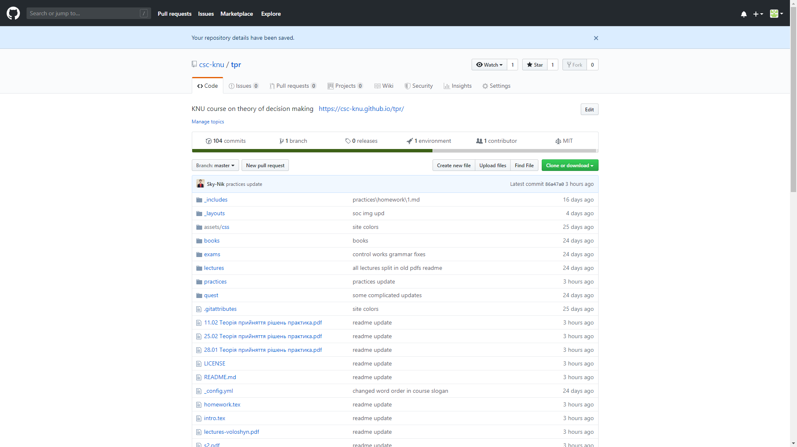
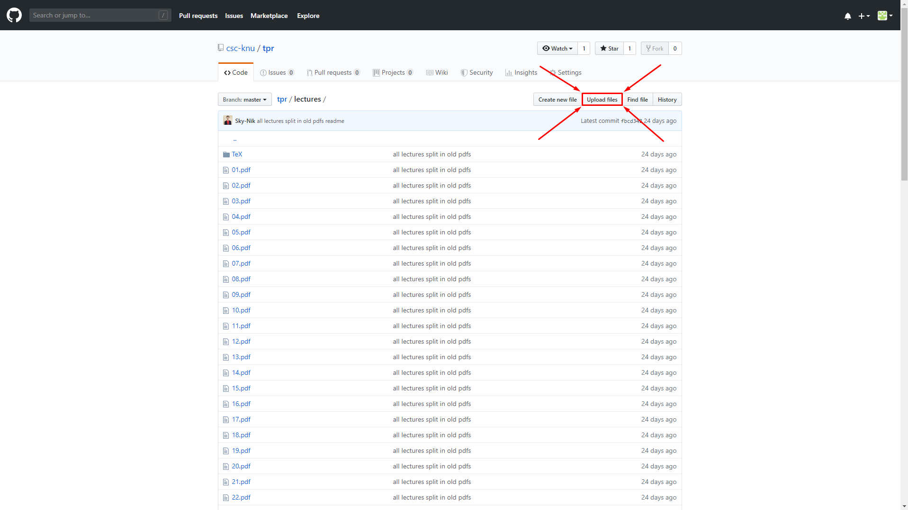
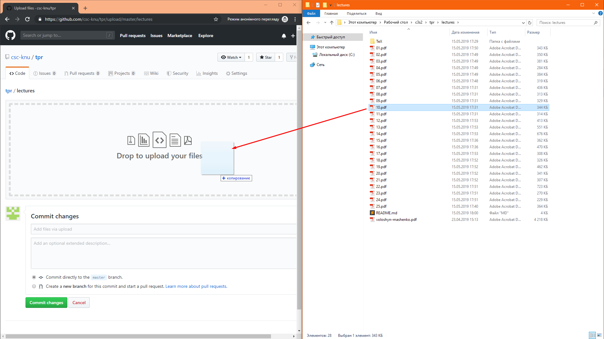
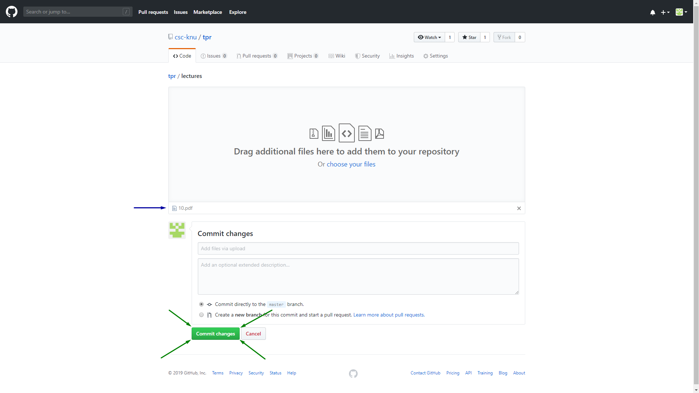
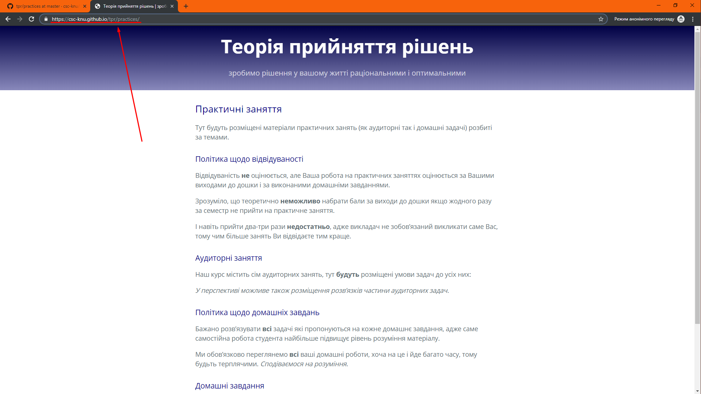
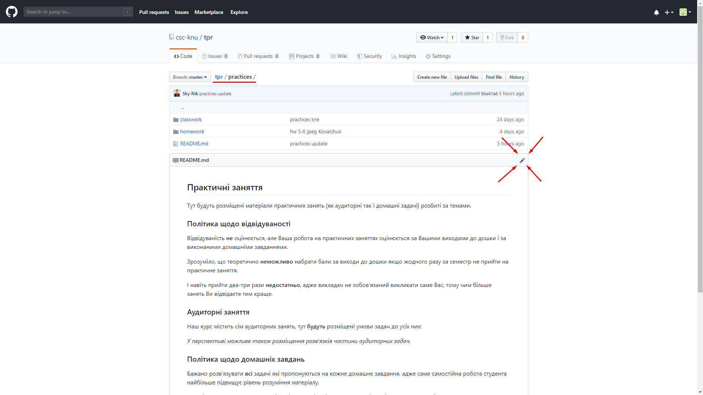
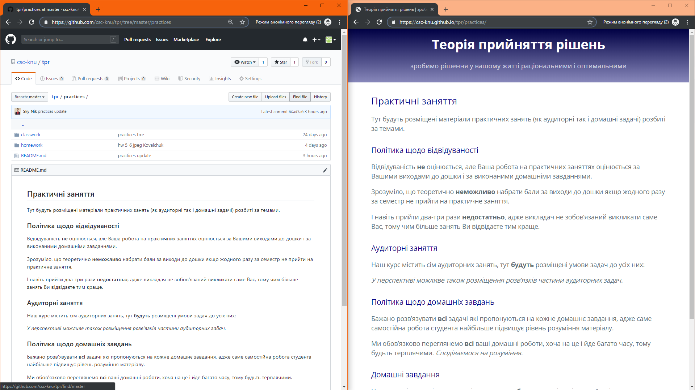
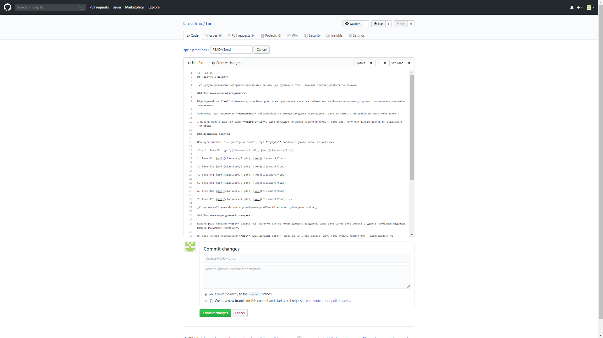

# Інструкція по наповненню сайту

1. Заходите на GitHub: [посилання для входу](https://github.com/login?return_to=%2Fjoin%3Fsource%3Dheader-home), реквізити:

    - username: `csc-knu`

    - password: `вводите пароль який ви отримали в електронному листі від мене`

    _Потім я (або Ви самі) заведу для Вас акаунт на GitHub, додам у колабораторів окремо на курс ТПР, і будете залогінюватися через нові реквізити, але поки що простіше так, щоб Ви одразу могли &laquo;погратися&raquo; з сайтом, не відволікаючисья на всякі сторонні реєстрації._

2. Заходите на сторінку репозиторію: [посилання для входу](https://github.com/csc-knu/tpr)

    _Репозиторій &mdash; спеціальний сервер, на якому зберігається і з якого можна завантажити програмне забезпечення._

    Якщо все добре то Ви маєте бачити наступне вікно:

    

    _Якщо погано видно це зображення то можна клацнути правою кнопкою миші і сказати &laquo;відкрити у новій вкладці&raquo;, а потім наблизити зображення натискаючи `Ctrl` і `+` одночасно._

3. Знаходите у дереві директорій (папок) потрібний Вам файл:

    1. Якщо це просто файл з якоюсь лекцією (`.pdf`) то його можна замінити завантаживши оновлений файл з тією ж назвою.

       1. Для завантаження файлів натискаєте кнопку `Upload files` вгорі:

          

       2. Далі відкривається ось таке вікно у яке можна просто перетягнути файл з довільної папки на вашому ПК:

          

       3. Про успішне завантаження файлу у вікно сигналізує поява його назви (показано синьою стрілкою на малюнку нижче). 

          

       4. Залишається тільки натиснути зелену кнопку `Commit changes` (грубо кажучи _зберегти зміни_&thinsp;), виділену зеленими стрілками на малюнку вище.

    2. Якщо це власне web-сторінка, то потрібно:

       1. Перейти у потрібну директорію. Наприклад, Ви бажаєте змінити сторінку `https://csc-knu.github.io/tpr/practices/`. Це посилання можна побачити у пошуковому рядку браузера:

          

       2. Потрібно перейти у відповідну директорію, у нашому прикладі це `practices/`. Зауважте, що назвою директорії є все що йде після `https://csc-knu.github.io/tpr/`, підкреслено червоним на малюнку нижче:

          

       3. У вікні зображеному вище Ви побачите спрощену версію тієї web-сторінки яку Ви хочете змінити, ось приклад порівняння:

          

       4. Далі Ви просто натискаєте на олівець, виділений червоними стрілками:

          

       5. Відкривається простий текстовий редактор, у якому Ви можете внести зміни (для зручності там одразу вбудовано примітивне прев'ю, тому зрозуміло які метасимволи за яке форматування відповідають):

          

       6. Залишається тільки натиснути зелену кнопку `Commit changes` (грубо кажучи _зберегти зміни_&thinsp;), виділену зеленими стрілками на малюнку вище.

4. Через певний час (в залежності від розміру змінених файлів, від 15 секунд до 2 хвилин) зміни мають відобразитися на сайті.
