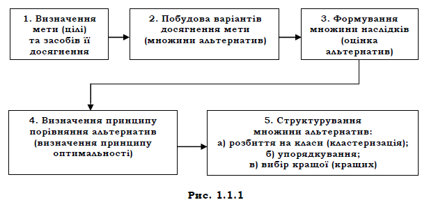
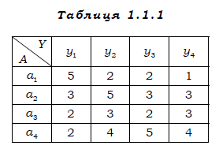
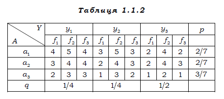
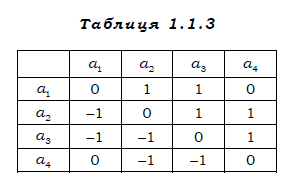
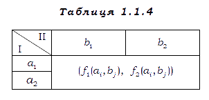
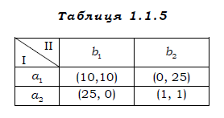



<!-- MarkdownTOC -->

- [Розділ 1: Базові основи прийняття рішень](#розділ-1-базові-основи-прийняття-рішень)
	- [&sect;1. Загальна задача прийняття рішень](#sect1-загальна-задача-прийняття-рішень)
		- [Визначення мети та засобів](#визначення-мети-та-засобів)
		- [Способи формалізації основних типів цілей](#способи-формалізації-основних-типів-цілей)
		- [Побудова множини варіантів дій і їхніх наслідків](#побудова-множини-варіантів-дій-і-їхніх-наслідків)
		- [Визначення принципу оптимальності та структурування множини альтернатив](#визначення-принципу-оптимальності-та-структурування-множини-альтернатив)

<!-- /MarkdownTOC -->

# Розділ 1: Базові основи прийняття рішень

Якщо дотримуватись класифікації проблем прийняття рішень американських учених Г.&nbsp;Саймона й А.&nbsp;Н'юєлла [[11]](../books/README.md), то типові задачі дослідження операцій відносяться до добре структурованих або кількісно сформульованих. У таких проблемах суттєві залежності відомі настільки добре, що можуть бути вираженими в числах або символах, які у підсумку отримують чисельні оцінки. Вивчення реальної ситуації, що моделюється, може вимагати великого обсягу часу. Необхідна інформація може мати високу вартість, але за наявності засобів і високої кваліфікації дослідників є всі можливості знайти адекватне кількісне описання проблеми, критерій якості та кількісні зв'язки між змінними.

По-іншому складається справа у слабо структурованих проблемах. Тут частина інформації, що необхідна для повного й однозначного визначення вимог до розв'язку, принципово відсутня. Дослідник, як правило, може визначити основні змінні, встановити зв'язок між ними, тобто побудувати модель, що адекватно описує ситуацію. Але при цьому залежності між критеріями взагалі не можуть бути визначеними на основі об'єктивної інформації, що мається в дослідника.

Більше того, існують проблеми, у яких відомий лише перелік основних параметрів, але кількісні зв'язки встановити між ними неможливо. У таких випадках структура, що розуміється як сукупність зв'язків між параметрами, невизначена і проблема називається неструктурованою.

Будемо вважати, що _структуровані_ (добре структуровані) задачі відносяться до предмета дослідження операцій, _слабо структуровані_ &mdash; до компетенції прийняття рішень, _неструктуровані_ &mdash; до штучного інтелекту.

## &sect;1. Загальна задача прийняття рішень

Схему прийняття рішень можна описати в такому вигляді (див.&nbsp;рис.&nbsp;1.1.1).

Загалом кожен блок 1&ndash;5 наведеної схеми (&laquo;загальної задачі прийняття рішень&raquo; &mdash; ЗЗПР) потребує конкретизації та певної формалізації. Задача із заданою множиною альтернатив $$\Omega$$ і принципом оптимальності ОП називається загальною задачею оптимізації, зміст якої полягає у виділенні множини &laquo;кращих&raquo; альтернатив ОП($$\Omega$$), зокрема, якщо принцип оптимальності задається скалярною функцією вибору на $$\Omega$$, то маємо звичайну оптимізаційну задачу (наприклад, лінійного програмування). Якщо принцип оптимальності задається множиною критеріальних функцій, то маємо задачу багатокритеріальної оптимізації. Задача з відомою множиною альтернатив $$\Omega$$ і явно заданим принципом оптимальності називається задачею вибору.

-><-

У процесі розв'язання загальної задачі прийняття рішень, як правило, беруть участь три групи осіб: _особи, що приймають рішення_ (ОПР), _експерти_ (Е) та _консультанти_ (К).

ОПР називають людину (або колективний орган такий, як науковий заклад, Верховна рада), що має (формує) ціль, яка слугує мотивом постановки задачі та пошуку її розв'язання. ОПР визначає також, які засоби є допустимими (недопустимими) для досягнення мети.

_Експерт_ &mdash; це спеціаліст у своїй галузі, що володіє інформацією про задачу, але не несе прямої відповідальності за результати її розв'язання. Експерти допомагають ОПР на всіх стадіях постановки й розв'язання ЗПР.

_Аналітиками_ (консультантами, дослідниками) називають спеціалістів із теорії прийняття рішень. Вони розробляють модель (математичну, інформаційну) задачі прийняття рішень (ЗПР), процедури прийняття рішень, організовують роботу ОПР і експертів.

У найпростіших ситуаціях ОПР може виступати одним у трьох ролях, у більш складних &mdash; ОПР може поєднувати функції аналітика, звертаючись до спеціалістів із вузьким профілем для вирішення часткових проблем. У загальному випадку ОПР (наприклад, президент або профільний комітет Верховної Ради) залучає до вирішення державних проблем аналітиків &mdash;консультантів, які, у свою чергу, звертаються до експертів. ОПР &mdash; головнокомандуючий має колективного консультанта &mdash; Генеральний штаб, який, у свою чергу, організовує роботу експертів &mdash; спеціалістів з озброєння, хімічного й біологічного захисту, політологів, метеорологів тощо.

У практичних (прикладних) задачах прийняття рішень формалізація кожного кроку процесу прийняття рішень (поданих на рис.&nbsp;1.1.1) пов'язана з певними, іноді дуже складними, проблемами. У першу чергу, постає проблема визначення мети та засобів її досягнення. Можна ставити апріорі недосяжні або навіть абсурдні чи злочинні цілі (&laquo;моя мета &mdash; пробігти стометрівку за п'ять секунд&raquo;, &laquo;наша мета &mdash; комунізм&raquo;, &laquo;наша мета &mdash; чистота раси&raquo; і т.&nbsp;д.). Можна використовувати нецивілізовані, навіть злочинні, методи досягнення цілком досяжної мети (&laquo;мета &mdash; стати президентом&raquo;, &laquo;стати багатим&raquo;, &laquo;отримати п'ятірку на іспиті&raquo; і т.&nbsp;д.).

Але зараз не про це. Нас цікавить формалізація ЗЗПР, її описання на мові математики з метою моделювання практичних ситуацій прийняття рішень. І якщо математична модель призведе до факту неіснування розв'язку поставленої задачі, наша мета буде досягнутою. Припустимо тепер, що мета й методи її досягнення визначені. Постає проблема побудови множини альтернатив &mdash; варіантів дій, направлених на досягнення мети. Тут, у першу чергу, виникає проблема побудови &laquo;повного списку&raquo; альтернатив. Можлива ситуація, коли не включення певної альтернативи призведе до неможливості розв'язання задачі або до її &laquo;неякісного&raquo; розв'язання. Так, не включення до економічної системи колишнього СРСР ринкових механізмів призвело до деградації суспільства й розпаду СРСР.

Не менш складною є проблема оцінки альтернатив &mdash; &laquo;до чого приведе та чи інша вибрана дія&raquo;. Як правило, оцінки альтернатив мають суб'єктивний характер, вони отримуються на основі обробки експертної інформації. Навіть якщо можна оцінювати альтернативи за допомогою &laquo;об'єктивних&raquo; процедур (наприклад, вимірювати вагу товару, відстань між населеними пунктами), постає проблема визначення всіх або хоча б &laquo;найважливіших&raquo; аспектів оцінки кожної альтернативи. Тут також неврахування навіть одного аспекту в оцінці варіантів дії може призвести до катастрофічних наслідків (згадаймо Чорнобильську катастрофу &mdash; неврахування ризику аварії при будівництві АЕС привело до трагічних результатів).

Остання принципова складність (але не остання за значенням) &mdash; вибір принципу порівняння альтернатив і на його основі &mdash; принципу оптимальності. Якщо на попередньому етапі визначені числові оцінки альтернатив, то вибір принципу оптимальності зводиться до вибору критерію (критеріїв) оптимізації, який максимально відповідає меті ЗЗПР. Так, якщо для тренера футбольної команди мета &mdash; перемога у наступному матчі, то за принцип оптимальності може слугувати такий критерій: &laquo;Перемагає та команда, яка виконує за матч більшу сумарну кількість успішних тактично-технічних елементів&raquo; (передач м'яча, відборів, ударів по воротах і т.&nbsp;д.). Такий принцип не раз висловлював В.&nbsp;Лобановський. Як правило, визначення (побудова, прийняття) принципу оптимальності відбувається у декілька етапів. Так, якщо мета ЗЗПР описується декількома числовими критеріями (і, отже, маємо задачу багатокритеріальної оптимізації), необхідно визначити &mdash; на основі якого &laquo;глобального&raquo; принципу оптимальності будуть порівнюватись (і вибиратись кращі) альтернативи.

Проблеми реалізації останнього блоку схеми пов'язані, у першу чергу, із математичними труднощами розв'язання задач, що виникають. Тут і велика розмірність, і проблеми існування розв'язку, і збіжність процедур його побудови і т.&nbsp;д.

Розглянемо приклади змістовної інтерпретації блоків ЗЗПР.

### Визначення мети та засобів

Розглянемо такі приклади.

1. Християнська доктрина визначає мету земного існування людини як &laquo;спасіння душі&raquo;. Засоби &mdash; будь-які, що не суперечать заповідям &laquo;Нового заповіту&raquo; (не вбивай; не гнівайся на ближнього; не чини перелюбу; не клянись, але виконуй клятви свої перед Господом; не протився злому, і коли вдарить тебе, хто у праву щоку твою, &mdash; підстав йому й іншу; любіть і ворогів своїх; про милостиню; про піст; складайте собі скарби на небі; покладайте на Бога надію свою; не судіть своїх ближніх (&laquo;Не суди, але викривай&raquo;); ходіть дорогою вузькою; стережіться фальшивих пророків; чиніть волю отця вашого небесного; не будуйте на піску).

2. Сучасна гуманістична доктрина визначає ціль життя людини як &laquo;самореалізацію&raquo; (Е.&nbsp;Фромм) [[44]](../books/README.md). Засоби досягнення цієї мети визначаються, перш за все, &laquo;Декларацією прав людини&raquo;, у якій на першому місці, безумовно, стоїть християнський принцип &laquo;не убий&raquo; (&laquo;право на життя&raquo;). Інші біблійні принципи не є категоричними імперативами. Із принципом &laquo;Не вбивай&raquo; тісно пов'язана проблема смертної кари. Якщо мета &mdash; &laquo;справедливість за будь-яку ціну&raquo; (зокрема, &laquo;око за око, зуб за зуб&raquo;), то смертна кара допустима. Але, якщо дещо переформулювати проблему смертної кари &mdash; чи згодні ви, щоб разом із шістьма злочинцями був страчений один невинний (а саме така статистика хибних смертних вироків за останні 150 років у Європі й Америці), то принцип &laquo;справедливість за будь-яку ціну&raquo; стає зовсім не очевидним.

3. Видатний філософ ХХ&nbsp;ст. Микола Бердяєв визначав мету життя людини не як &laquo;спасіння&raquo;, а як &laquo;творче сходження&raquo;, засіб &mdash; &laquo;свобода&raquo; [[13]](../boks/README.md).

4. 
	- &laquo;Хто ж вони, справжні філософи? Ті, хто метою мають істину&raquo; (Платон).

	- &laquo;Життя перестає прив'язувати до себе щойно зникає мета&raquo; (І.&nbsp;Павлов).

	- &laquo;Минуле і сучасне &mdash; наші засоби, тільки майбутнє &mdash; наша мета&raquo; (Блез Паскаль).

	- &laquo;Мета влади &mdash; влада&raquo; (Дж.&nbsp;Оруел).

5. Мета &mdash; вилікувати хворого. Засоби &mdash; усе те, що надається системою охорони здоров'я.

6. Мета &mdash; побудувати літак. Засоби &mdash; 300&nbsp;млн&nbsp;грн. на початок 2010&nbsp;р.

7. Мета &mdash; виграти футбольний матч, засоби у тренера &mdash; сформувати команду на даний матч із наявних 25 футболістів.

8. Мета &mdash; &laquo;щастя всього людства&raquo;. Цю мету висували й висувають філософи, політики, пророки, авантюристи. І якщо з метою все зрозуміло (про формалізацію терміна &laquo;щастя&raquo; тепер не йдеться &mdash; на Всесвітньому економічному форумі в Давосі в січні 2006&nbsp;р. один із семінарів мав назву &laquo;Щастя &mdash; це&hellip;&raquo;), то із засобами її досягнення набагато складніше. Згадаймо хоча б Ф.&nbsp;Достоєвського &mdash; &laquo;щастя всього людства не варте однієї сльозинки дитини&raquo;; Мао Цзедуна &mdash; &laquo;заради перемоги соціалізму можна пожертвувати половиною людства&raquo;; Ф.&nbsp;Ніцше &mdash; &laquo;хочеш бути щасливим &mdash; не мрій&raquo;.

	Доцільно тут згадати і слова: &laquo;Політики &mdash; це люди, найбільш нерозбірливі в засобах (досягнення мети)&raquo;. Сучасна історія, на жаль, повністю підтверджує цей вислів. Прикладів тут безліч, і читач легко може їх навести. Ми ж лише процитуємо слова Максима Горького про те, що &laquo;Леніну, як вождю, притаманна для цієї ролі необхідність у відсутності моралі&raquo; і слова Мітчела Канора (розробника &laquo;Lotus&raquo;), який називає Білла Гейтса &laquo;найуспішнішим і яскравим представником тих, хто грає на стратегії &mdash; перемога за будь-яку ціну&raquo;. А взагалі проблема &laquo;мета &mdash; засоби&raquo; стара як світ. Ми ж приєднуємось до думки, що історичний досвід показує, що відмова від вимог моралі є завжди програшною стратегією.

9. Мета &mdash; отримання максимального задоволення від життя (про формалізацію поняття задоволення див. вище у Е.&nbsp;Фромма). Засоби студента &mdash; 50&nbsp;грн (на початок 2009&nbsp;р.).

10. Мета викладача &mdash; навчити студента своєму предмету, засоби викладання &mdash; &laquo;цікаво, зрозуміло і &hellip; весело&raquo; (принцип видатного вченого і педагога ХХ&nbsp;ст. академіка &mdash; фізика П.&nbsp;Капіци).

	40-х&nbsp;рр. ХХ&nbsp;ст., у першу чергу, Н.&nbsp;Вінером, який писав, що термін &laquo;цілеспрямоване&raquo; означає, що дія або поведінка допускає тлумачення як направлені на досягнення деякої мети, тобто деякого кінцевого стану, при якому об'єкт вступає у певний зв'язок у просторі або часі з деякими іншими об'єктами або подіями. Із філософськими аспектами в об'єктивізації поняття мети можна ознайомитись у роботі [[11]](../books/README.md).

### Способи формалізації основних типів цілей

Розглянемо основні типи цілей і способи їхньої формалізації, що застосовуються при прийнятті рішень.

&laquo;Якісна&raquo; ціль характеризується тим, що будь-який результат або повністю задовольняє ці цілі або повністю не задовольняє, причому результати, що задовольняють ці цілі нерозрізненні між собою точно так як нерозрізнені між собою й результати, що не задовольняють ці цілі. Наприклад, ціль &mdash; стати чемпіоном. І якщо ціль досягнуто, то немає значення, як її досягнуто &mdash; наполегливим тренуванням, підкупом суддів, знищенням конкурентів тощо. Якісну ціль можна формалізувати у вигляді деякої підмножини $$A$$ множини всіх можливих результатів, де будь-який результат $$a \in A$$ задовольняє цій цілі, а будь-який результат $$a \notin A$$ не задовольняє їй. Множина $$A$$ при цьому називається цільовою підмножиною. Так, якщо ціль &laquo;зайняти призове місце&raquo;, то цільова множина $$A$$ &mdash; перші три місця з усіх можливих.

Якісну ціль (її можна назвати якісною &laquo;чіткою&raquo; ціллю) можна узагальнити так. Нехай кожному результату а відповідає &laquo;ступінь&raquo; виконання цілі $$0 \le \mu(a) \le 1$$. Зокрема, якщо ціль чітка, то $$\mu(a) = 1$$, якщо $$a \in A$$; $$\mu(a) = 0$$, якщо $$a \notin A$$. Так, нехай у останньому прикладі $$\mu(І місце) = 1$$, $$\mu(II) = 0.9$$, $$\mu(III) = 0.7$$ і &laquo;нечітка&raquo; цільова множина $$A$$ визначається умовою: $$\mu(a) \ge 0.7$$. Зазначимо, що значення функції $$\mu(a)$$ (функція &laquo;належності&raquo; &mdash; див.&nsp;Розділ&nbsp;7 &laquo;Прийняття рішень в умовах нечіткої інформації&raquo;) не є оцінкою результату $$a$$, а лише &laquo;ступінь&raquo; його належності до цільової множини $$A$$ (можливо &laquo;націлюватись&raquo; на І місце недоцільно з погляду прикладання надмірних зусиль).

&laquo;Кількісна&raquo; ціль є результатом вибору на множині результатів, що описуються кількісно, за допомогою деякої дійснозначної функції $$f: A \to E^1$$. Задача прийняття рішень у цьому випадку зводиться до знаходження оптимуму (максимуму чи мінімуму) функції $$f$$ на множині $$A$$. Зазначимо, якщо &laquo;якісну чітку&raquo; ціль формально можна звести до &laquo;кількісної&raquo;:

$$
f(a) = \begin{cases}
	1, & a \in A, \\
	0, & a \notin A,
\end{cases}
$$

то ЗПР з &laquo;якісною нечіткою&raquo; ціллю вимагають додаткової інформації до своєї формалізації.

Якщо цільова функція є векторною, тобто кожен результат описується набором чисел, що характеризують його &laquo;вартість&raquo;, &laquo;ефективність&raquo;, &laquo;надійність&raquo;, то маємо задачу багатокритеріальної оптимізації.

Зазначимо, якщо ціль задано з допомогою скалярної цільової функції $$f$$, то можна визначити пов'язану з цією ціллю перевагу серед результатів: із двох результатів кращим буде той, якому відповідає більше (менше) значення цільової функції (при рівних значеннях цільової функції говорять про байдужність результатів). Назвемо таку перевагу перевагою, що пов'язана з цільовою функцією $$f$$. Але можна говорити про перевагу й без наявності цільової функції, задаючи множину пар результатів, для яких перший результат у парі є кращим за другий (або не гіршим). Останнє означає, що на декартовому добутку результатів $$A \times A$$ задане деяке бінарне відношення. За заданим бінарним відношенням у загальному випадку неможливо побудувати цільову функцію, пов'язану з ним. Відомі достатні умови (властивості), яким повинно задовольняти бінарне відношення для того, щоб існувала цільова функція, пов'язана з ним (див.&nbsp;Розділ&nbsp;2 &laquo;Основи теорії корисності&raquo;). Отже, задання переваг у вигляді бінарного відношення на множині результатів є більш загальною формою формалізації цілі. З іншого боку, на практиці дуже часто відношення переваги задається саме бінарним порівнянням &mdash; про це говорить і народна мудрість &laquo;Усе пізнається у порівнянні&raquo;.

### Побудова множини варіантів дій і їхніх наслідків

Формально блоки 2 і 3 схеми ЗЗПР є незалежними, але змістовно зв'язаними (для чого розглядати альтернативи, які не можна принципово оцінити?). Тому на прикладах розглянемо їх сумісно. У блоці&nbsp;2 альтернативи будуються на основі евристичних, неформальних процедур; у блоці&nbsp;3 на основі формально-математичних, експертних процедур здійснюється оцінювання їхніх наслідків.

Розглянемо основні типи залежностей між альтернативами та наслідками.

Найпростіший тип залежності &mdash; _детермінований_, коли кожна альтернатива приводить до єдиного наслідку. При цьому між альтернативами та наслідками існує функціональна залежність і такі ЗПР називаються _ЗПР в умовах визначеності_. Наявність функціональної залежності приводить до того, що ЗПР достатньо описувати лише у термінах цілі й альтернатив.

Найчастіше вибрана альтернатива може привести до множини наслідків. Такий тип залежності називається _недетермінованим_. При цьому між альтернативами та наслідками не існує функціональної залежності й такі ЗПР називаються ЗПР в умовах невизначеності. Невизначеність є проявом впливу на наслідок зовнішнього середовища, як ще кажуть &mdash; природи. Якщо при цьому задано розподіл станів природи, то маємо _ЗПР в умовах ризику_. Якщо невизначеність є проявом впливу на наслідок інших ОПР, які мають свої цілі, то така задача називається _ЗПР в умовах конфлікту_.

Інколи, як множини альтернатив (наслідків), так і зв'язок між ними є _нечіткими_. При цьому між альтернативами й наслідками також не існує функціональної залежності і такі ЗПР називаються _ЗПР в умовах нечіткої інформації_. Нечіткість, як правило, є проявом суб'єктивності ОПР, експертів та аналітиків, які формулюють ЗПР.

Пропонуємо читачеві (як завдання на самостійну роботу) побудувати множину варіантів для досягнення мети в умовах визначених засобів для наведених вище прикладів.

Детальніше проаналізуємо проблему&nbsp;1.9 &mdash; &laquo;Отримати максимальне задоволення за 50&nbsp;грн&raquo;. Можливі дії: $$a_1$$ &mdash; піти в кіно; $$a_2$$ &mdash; піти на дискотеку; $$a_3$$ &mdash; придбати книгу; $$a_4$$ &mdash; залишитись вдома і т.&nbsp;д.

Цілком можливо, що два різні індивіди оцінять альтернативи (наслідки вибраних дій) так: $$a_1$$ &mdash; 5&nbsp;балів, $$a_2$$ &mdash; 4, $$a_3$$ &mdash; 2, $$a_4$$ &mdash; 1 (екстраверт, кінолюб); $$a_1$$ &mdash; 2, $$a_2$$ &mdash; 1, $$a_3$$ &mdash; 5, $$a_4$$ &mdash; 3 (інтраверт, бібліофіл). У цій задачі зв'язок між альтернативами й наслідками є детермінованим, ЗПР достатньо описувати лише у термінах цілі й альтернатив.

Зв'язок між альтернативами та наслідками найчастіше є недетермінованим, залежним від &laquo;станів природи&raquo;.

Так, збираючись зранку на заняття, залежно від станів природи $$y_1$$&ndash;$$y_4$$ (тепло &mdash; сонячно, тепло &mdash; дощ, холодно &mdash; сонячно, холодно &mdash; дощ), студент повинен вибрати одну з альтернатив $$a_1$$&ndash;$$a_4$$ (іти в одному костюмі, взяти парасольку, одягнути плащ, пальто). Оцінки альтернатив (за чотирибальною шкалою) внесемо у табл.&nbsp;1.1.1:

Якщо в прикладі&nbsp;1.1.6 замовником промисловості виступає уряд, то альтернативами можуть бути конструкторські бюро й літакобудівні заводи України (Київ, Харків), Росії тощо. Обираючи меню, ОПР оцінює комплексний обід за трьома критеріями: за п'ятибальною шкалою &mdash; вартість ($$f_1$$ &mdash; мінімізувати), калорійність ($$f_2$$ &mdash; максимізувати або мінімізувати), смакові якості ($$f_3$$ &mdash; максимізувати). Крім того, нехай оцінки за переліченими критеріями залежать від стану &laquo;природи&raquo; (у якого з трьох постачальників було закуплено продукти), причому відомі ймовірності реалізації станів (із імовірністю&nbsp;$$1/4$$ товари було закуплено у І або ІІ постачальника, із імовірністю&nbsp;$$1/2$$ &mdash; у ІІІ). Нехай також ОПР вибирає альтернативи за допомогою деякого випадкового механізму, зумовленого тим, що двічі на тиждень доцільно вибирати пісну дієту (альтернатива $$a_3$$ &mdash; салат з капусти, овочевий суп, каша, компот), двічі &mdash; рибну ($$a_2$$ &mdash; салат з огірків, борщ, риба, сік) і тричі &mdash; м'ясну ($$a_1$$ &mdash; салат з капусти, солянка, котлети, компот). Тоді оцінки наслідків можна описати табл.&nbsp;1.1.2 ($$q$$ &mdash; імовірнісний розподіл станів природи, $$p$$ &mdash; розподіл альтернатив).

У прикладі&nbsp;1.1.7 ОПР (тренер) знає лише &laquo;порівняльний&raquo; стан готовності футболістів, наприклад, нападників (усього їх четверо). Цю інформацію подамо в табл.&nbsp;1.1.3, де елемент $$a_{ij} = 1$$, якщо у футболіста $$a_i$$ готовність краща, ніж у $$a_j$$ ($$i \ne j$$); $$a_{ij} = 0$$, якщо стан готовності однаковий (зокрема, $$a_{ii} = 0$$); $$a_{ij} = -1$$, якщо у футболіста ai готовність гірша, ніж у ($$a_i \ne a_j$$). На основі цієї таблиці необхідно побудувати відношення пріоритету серед чотирьох нападників. Якщо склад команди формує не один тренер, потрібно спочатку &laquo;інтегрувати&raquo; думки тренерів, що представлені у табл.&nbsp;1.1.3.

&laquo;Станом природи&raquo; може виступати інший ОПР і задача &laquo;прийняття рішення в умовах конфлікту&raquo; опишеться такою табл.&nbsp;1.1.4, де $$a_1$$, $$a_2$$ &mdash; дії (стратегії) першого ОПР (гравця); $$b_1$$, $$b_2$$ &mdash; другого.

При виборі стратегії ai першим гравцем, $$b_j$$ &mdash; другим, виграш першого складе $$f_1(a_i, b_j)$$, другого &mdash; $$f_2(a_i, b_j)$$. Як подібну задачу розглянемо відому проблему &laquo;Дилема бандита&raquo; [[6]](../books/README.md). Двох спійманих злочинців, яких підозрюють у скоєнні групового злочину (за груповий злочин покарання більше), розсаджують у різні камери (інформаційний обмін між ними &mdash; &laquo;переговори&raquo; &mdash; неможливі). &laquo;Виграші&raquo; наведені у табл.&nbsp;1.1.5, де $$a_1$$, $$b_1$$ &mdash; стратегія &laquo;зізнатися&raquo;, $$a_2$$, $$b_2$$ &mdash; &laquo;не зізнаватись&raquo;, ($$f_1, f_2$$) &mdash; кількість років, які отримає кожен із бандитів.

### Визначення принципу оптимальності та структурування множини альтернатив

Блоки 4, 5 загальної схеми принципово різні &mdash; у блоці&nbsp;4 на основі неформальних міркувань вибирається принцип оптимальності, у блоці 5 &mdash; на основі формально-математичних процедур розв'язуються задачі вибору; із практичного погляду &mdash; блоки 4 і 5 доцільно розглядати сумісно.

Будемо вважати, що в табл.&nbsp;1.1.1 стани природи рівноймовірні, тоді логічним принципом оптимальності може бути вибір за середньою або сумарною оцінкою альтернатив (і буде вибрано $$a_4$$). Не менш логічними будуть такі міркування &mdash; при виборі $$a_1$$ найгірша оцінка дорівнює 1, $$a_2$$ &mdash; 3, $$a_3$$ &mdash; 2, $$a_4$$ &mdash; 2. Отже, якщо вибрати $$a_2$$, то менше за 3 отримати не можна. За таким критерієм буде вибрано (і теж цілком логічно) альтернатива $$a_2$$. Найменша залежність від &laquo;станів природи&raquo; (різниця між найкращою і найгіршою оцінками) гарантується альтернативою $$a_3$$. Зверніть увагу, що &laquo;логічні&raquo; міркування привели до протилежних наслідків.

Нехай тепер стани природи у цій задачі не рівноймовірні &mdash; імовірність стану $$y_1$$ $$p(y_1) = 0.4$$; $$p(y_2) = 0.3$$; $$p(y_3) = 0.2$$; $$p(y_4) = 0.1$$. Тоді як &laquo;сумарну оцінку&raquo; альтернатив логічно взяти математичне сподівання

$$
M(a_i) = \Sum_j f(a_i, y_j) p(y_j).
$$

Маємо: $$M(a_1) = 5 \cdot 0.4 + 4 \cdot 0.3 + 2 \cdot 0.2 + 1 \cdot 0.1 = 3.7$$; $$M(a_2) = 3.6$$; $$M(a_3) = 2.4$$, $$M(1_4) = 3.4$$. Отже, при певних імовірностях станів природи кращою альтернативою стала альтернатива $$a_1$$ (хоча, звичайно, із імовірністю $$0.1$$ вибір альтернативи $$a_2$$ гарантує незагартованому студенту гостре респіраторне захворювання).
Для табл.&nbsp;1.1.2 логічно взяти середню оцінку для кожної альтернативи по кожному постачальнику (нехай усі критерії максимізуються, оцінку &laquo;вартості&raquo; візьмемо зі знаком мінус) і підрахувати математичне сподівання по розподілу ймовірностей вибору постачальника: 

$$
M(a_1) = 5 \cdot 0.25 + 5 \cdot 0.25 + 4 \cdot 0.5 = 4.5; \quad M(a_2) = 5; \quad M(a_3) = 2.5.
$$

Далі, прийнявши за оцінку кожної альтернативи $$M(a_i)$$, логічно оцінити її математичним сподіванням із урахуванням імовірності її реалізації: $$\tilde M(a_i) = M(a_i) \cdot q_i$$. Маємо: 

$$
\tilde M(a_1) = 4.5 \cdot \frac{2}{7} = \frac{9}{7}; \quad \tilde M(a_2) = \frac{10}{7}; \quad \tilde M(a_3) = \frac{7.5}{7}.
$$

Таким чином, буде вибрана альтернатива $$a_2$$. Розглянемо &laquo;Дилему бандита&raquo;. Начебто непоганий вибір $$(a_2, b_2)$$, але тоді в кожного з бандитів виникатиме бажання &laquo;відхилитися&raquo; від даної ситуації: якщо перший поміняє $$a_2$$ на $$a_1$$, то його відпустять (перший зізнається й розповідає про спільників). Аналогічно у другого теж виникає бажання відхилитись від ситуації $$(a_2, b_2)$$. Якщо брати за принцип оптимальності &laquo;невигідність відхилення&raquo;, то як не парадоксально, буде вибраною ситуація $$(a_1, b_1)$$! Аби бандити могли домовлятись, то можливий вибір ситуації $$(a_2, b_2)$$ (з мінімізацією спільного терміну ув'язнення).

[Назад до лекцій](README.md)

[Назад на головну](../README.md)